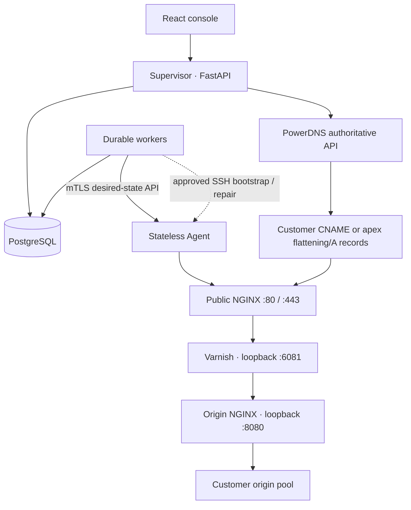

# Edgeplane CDN

A two-application CDN control plane. **Supervisor** owns desired state
in PostgreSQL. The database-free **Agent** manages revisioned NGINX and Varnish
configuration on each edge. Optional BIRD/BGP and shared anycast DNS publication
are available; there is no Redis or arbitrary shell API.

This repository contains the deployable control plane, durable worker, and edge
agent. Production operation still requires environment-specific capacity testing,
security review, backups, monitoring and a staged rollout; a README cannot replace
an acceptance sign-off.



## Start the control plane (no demo data)

```bash
python3 tools/dev_env.py     # once; refuses to overwrite existing .env
cd supervisor
docker compose up --build -d
```

Open **http://localhost:8000**. The normal Compose stack starts only PostgreSQL,
the Supervisor, and its worker; it does not start a sandbox agent or demo origin.
Username is `admin`; retrieve `ADMIN_PASSWORD`
from your local `supervisor/.env`. No shared default password exists. The first
login requires replacing the bootstrap password. Generated secrets are ignored
by Git and Docker build contexts.

For one complete local Docker edge using real NGINX and Varnish processes:

```bash
cd supervisor
docker compose -f docker-compose.yml -f docker-compose.lab.yml up --build -d
curl http://localhost:9443/ready
curl http://localhost:9091/-/ready
```

No demo records are inserted. The local edge runs the production Agent activation
path in `container` mode: candidate VCL compilation, `nginx -t`, atomic revision
activation, Varnish VCL load/use, and guarded NGINX reload. It is isolated from host
services and is intended for local flow verification, not as an Internet-facing POP.

For a real edge on this localhost or at a POP, use **Nodes → Add CDN node** and
enter that Ubuntu 22.04/24.04 host's SSH address plus its HTTPS management URL (normally
`https://<management-ip>:9443`). Verify the displayed SSH fingerprint, then choose
**Approve identity & provision**. The Supervisor installs the host-mode systemd
agent, NGINX, Varnish, exporters, and a unique mTLS identity. `localhost` means the
machine running the Supervisor process; from a Supervisor container, use a host
address reachable from that container instead of `127.0.0.1`.

`supervisor/maxmind/GeoLite2-City.mmdb` is included in the Supervisor image. During
real-agent provisioning it is copied to `/etc/cdn-agent/GeoLite2-City.mmdb`. Country
allow/deny and city rules configured on each vhost are rendered into NGINX, while
country traffic aggregation remains opt-in per vhost.

## Projects

- [`supervisor/`](supervisor/README.md): async FastAPI, normalized SQLAlchemy models,
  Alembic, PostgreSQL workers, SSH provisioning, mTLS PKI, PowerDNS, React console.
- [`agent/`](agent/README.md): FastAPI, versioned wire contract, deterministic Jinja
  templates, host/sandbox adapters, atomic activation, purge, status and bounded logs.
- [`docs/`](docs/architecture.md): architecture, security, operations and test evidence.
- [`tools/`](tools/dev_env.py): development utilities, not a third application.

## Configuration lifecycle

Every vhost/policy mutation acquires a PostgreSQL transaction advisory lock and
creates a monotonically numbered immutable snapshot. Configuration and TLS key
material in snapshots are encrypted. Workers claim durable targets using
`FOR UPDATE SKIP LOCKED` and hold a per-node PostgreSQL session advisory lock
through the operation. A disconnected worker releases its lock, making unfinished
work reclaimable. The Agent adds an inter-process file lock and rejects stale
revisions. Equal content hashes are NOOPs without a reload.

Candidates are rendered into fresh release directories. Varnish compilation and
NGINX candidate validation precede activation. Every NGINX reload has its own
immediately preceding successful `nginx -t`. Validation failure restores the old
pointer and returns failure without reload. Historical rollback creates a new
revision and restores normalized desired vhost data, rather than editing history.

## Customer traffic and DNS

Edgeplane does **not** edit a customer's authoritative zone when a vhost is created.
For a subdomain such as `www.customer.example`, the customer replaces that host's
existing A/AAAA RRset with a CNAME to the assigned hostname in the Edgeplane-managed
zone. A CNAME cannot coexist with A/AAAA at the same owner name; unrelated hosts'
A records remain unchanged. For a zone apex such as `customer.example`, use the
customer DNS provider's ALIAS/ANAME/CNAME-flattening feature, or A/AAAA records to
stable, actually routed CDN service addresses. Standard apex CNAMEs conflict with
mandatory SOA/NS data. The application does not provide apex flattening itself.

In **DNS → Shared anycast IPv4/IPv6**, enter only service addresses that are already
routed to the intended POPs and bound to their data plane. Reconciliation publishes
them as CDN-hostname A/AAAA answers instead of POP management or SSH addresses.
When no shared anycast addresses are configured, the reconciler publishes eligible
healthy POP public unicast addresses instead. BGP announcement and health must be
verified independently; a DNS A answer alone cannot prove BGP routing. Avoid
publishing a service address before every intended POP can receive it on port 80/443.

For a safe manual PowerDNS test, open **DNS → Live records**, choose a test name in
your managed zone (for example `dns-test.edge.example.net`), add or edit its A RRset,
save, then refresh the list. Check the authoritative answer with
`dig @<authoritative-server> dns-test.edge.example.net A`. Saving replaces the *whole*
RRset. Do not use a production CDN hostname for a throwaway test; a future reconcile
may overwrite application-managed records.

## Per-vhost request policy

- **Geography:** Choose `Only allow selected countries / cities`, enter `IR` for
  Iran-only access, and decide whether unknown locations should be blocked. This
  uses MaxMind estimation, not a strong identity or legal geofence.
- **Access rules:** Deny an exact path/prefix with HTTP 403 or allow only listed
  client CIDRs. Add a fixed HTTP 303 redirect for an exact path or prefix; use `/`
  with prefix matching for a whole-vhost redirect. Redirect targets are literal
  HTTP(S) URLs; original paths and queries are not appended.
  A path may also route to one explicitly selected origin in the vhost; unmatched
  paths continue through its normal origin pool. Route prefixes are literal and
  the vhost's cache and access policies continue to apply.
- **Cache:** One default cache policy applies to vhosts that have no explicit cache
  policy selection. A vhost can select another policy; the Agent renders its policy
  into the Varnish desired-state snapshot.
- **Policy inheritance:** Cache, rate-limit, Real IP, and header policy collections
  each have one global default. A vhost with a null policy ID inherits that default;
  setting the corresponding `*_policy_id` through the API creates a per-vhost
  override. `GET /api/v1/vhosts` reports `effective_policies`, including its source,
  name, ID, and resolved configuration.
- **Rate limiting:** `rate` is sustained requests per second per resolved client IP
  or configured header value. `burst` is temporary token-bucket capacity, not a ban
  period. For `rate=200`, `burst=400`, and `nodelay=true`, a short excess burst can
  pass immediately; later excess requests receive 429 until capacity refills at
  200 requests/second. There is no five-minute block. Use dry-run before enforcement.
- **Headers:** Request-policy JSON adds fixed headers to origin requests; response
  JSON adds headers sent to clients. `debug` emits `X-Served-By` and `X-Request-ID`.
  Reserved hop-by-hop, credential, and `X-CDN-*` headers are rejected by the schema.
- **Real IP:** List only trusted proxy CIDRs before using `X-Forwarded-For` (or a
  selected header). Without a trusted sender, a visitor's supplied XFF is not
  trusted. `recursive` walks trusted proxy hops. `forward_to_origin` sends the
  resolved address as `X-Real-IP` and `X-Forwarded-For`; otherwise those two are
  omitted. `X-Forwarded-Proto` and `X-Request-ID` are sent separately.

Certificates may be uploaded as a manual PEM chain/key pair or issued centrally by
Certbot using either distributed HTTP-01 through every active POP or PowerDNS DNS-01. HTTP-01 requires each requested domain to resolve to an active POP on port 80. DNS-01 is suitable for anycast and wildcard names because validation does
not depend on which POP receives an HTTP request. Keys are encrypted in PostgreSQL;
the selected certificate is included in desired state and terminates TLS on every
POP. Certbot-managed certificates are reissued before expiry and the renewed desired
state is synchronized to active nodes. Configure `ACME_DIRECTORY_URL` to Let's
Encrypt staging while testing, then switch to production after DNS issuance works.

Client TLS and origin TLS are independent:

| Client to POP | POP to origin | Edge certificate | Cache and HTTP policies |
|---|---|---|---|
| HTTP | HTTP | not required | enabled |
| HTTP | HTTPS | not required | enabled |
| HTTPS | HTTP | required on every serving POP | enabled |
| HTTPS | HTTPS | required on every serving POP | enabled |

With no selected edge certificate, NGINX intentionally listens only on port 80;
the origin's certificate cannot be presented to a browser because the browser's TLS
connection ends at the POP. Origin TLS verification is independently selectable.
When it is disabled, the POP still encrypts the origin connection and sends the
configured SNI, but does not validate the origin chain/name. HTTP-to-HTTPS redirect
is accepted only when an edge certificate is selected. An origin redirect or an HSTS
policy can still make a browser request HTTPS, so an HTTP-only vhost must not rely on
an HTTPS redirect. TLS passthrough is deliberately outside this HTTP CDN data plane:
it would bypass Varnish caching, header policy, path controls and HTTP rate limiting.

Traffic flows through public NGINX, Varnish for cacheable HTTP requests, loopback
origin NGINX, then the customer origin. WebSockets bypass Varnish. The Agent's
per-vhost NGINX logs feed traffic counters and optional hourly/country aggregates;
the Supervisor stores durable rollups in PostgreSQL. POP Prometheus/exporters
provide service-level metrics. The UI's Traffic and Monitoring pages are not a
packet-level source of truth; compare them with origin and edge access logs when
investigating loss or abuse.

## Operations and deployment

See [Supervisor setup](supervisor/README.md), [Agent setup](agent/README.md),
[real Ubuntu provisioning](docs/agent-provisioning.md),
[security](docs/security.md), [configuration lifecycle](docs/config-lifecycle.md),
[caching](docs/caching.md), [DNS](docs/dns.md), and
[troubleshooting](docs/troubleshooting.md).
[Prometheus metrics and remote write](docs/metrics.md) documents the per-vhost,
country, and POP labels and the safe Grafana connection options.

Production requires external PostgreSQL, HTTPS for the console, unique environment
secrets, an approved SSH host identity, and Agent mTLS. Kubernetes examples show
2 Supervisor and 2 worker replicas. Run the migration Job before rolling out pods.
The primary edge deployment is systemd; the Kubernetes Agent manifest is lab-only.

### Container inventory

The default Supervisor Compose project runs exactly one application server and one
durable worker. Supporting infrastructure is separate by design:

| Container | Purpose | Replica guidance |
|---|---|---|
| `cdn-supervisor-1` | UI, REST API and WebSocket status stream | 1 locally; 2+ behind a load balancer in production |
| `cdn-worker-1` | Claims provisioning/sync/reload jobs from PostgreSQL | exactly 1 locally; scale horizontally in production |
| `cdn-postgres-1` | durable desired state, audit, jobs and node activity | local only; managed HA PostgreSQL in production |
| `cdn-prometheus-1` | central/remote-write metrics aggregation | optional when POP Prometheus is queried directly |
| `cdn-migrate-1` | one-shot schema migration and bootstrap admin | exits with status 0; it is not a running replica |
| `edgeplane-edge-agent-1` | one full local NGINX/Varnish edge | exactly 1 for the localhost flow |

An exited `cdn-migrate-1` with code 0 is expected. It completed successfully and
does not consume a running worker slot.

### Production checklist

- Put the Supervisor behind an HTTPS reverse proxy and set `SUPERVISOR_PUBLIC_URL`
  and exact `ALLOWED_ORIGINS` values.
- Store PostgreSQL, encryption, SSH and CA secrets in a secrets manager; never commit
  `.env`, private keys, certificates, database volumes, or MaxMind license material.
- Use managed PostgreSQL with tested point-in-time recovery, connection pooling and
  alerts for job backlog, replication lag and storage.
- Provision POPs on supported Ubuntu hosts through verified SSH fingerprints. The
  remote installer uses systemd, mTLS, loopback-only exporters, NGINX and Varnish.
- Place customer traffic behind your tested unicast/Anycast and BGP design. Keep the
  management listener private and allow only Supervisor addresses to TCP/9443.
- Stage configuration, monitor failed targets, and test rollback before customer
  migration. Run load/capacity tests using your vhost count and traffic distribution.
- Configure Prometheus retention/remote-write and Grafana independently at each POP;
  alert on Agent, NGINX, Varnish, exporter, disk, certificate and BGP health.

## Tests

```bash
python3 -m venv .venv
.venv/bin/pip install -e './supervisor[dev]'
(cd agent && ../.venv/bin/python -m pytest -q)
(cd supervisor && ../.venv/bin/python -m pytest -q)
.venv/bin/ruff check agent supervisor tools
npm --prefix supervisor/frontend ci
npm --prefix supervisor/frontend run build
```

PostgreSQL integration and real data-plane tests are explicitly opt-in, documented
in [test evidence](docs/acceptance.md). A skipped integration test is not evidence
of a working external system.
