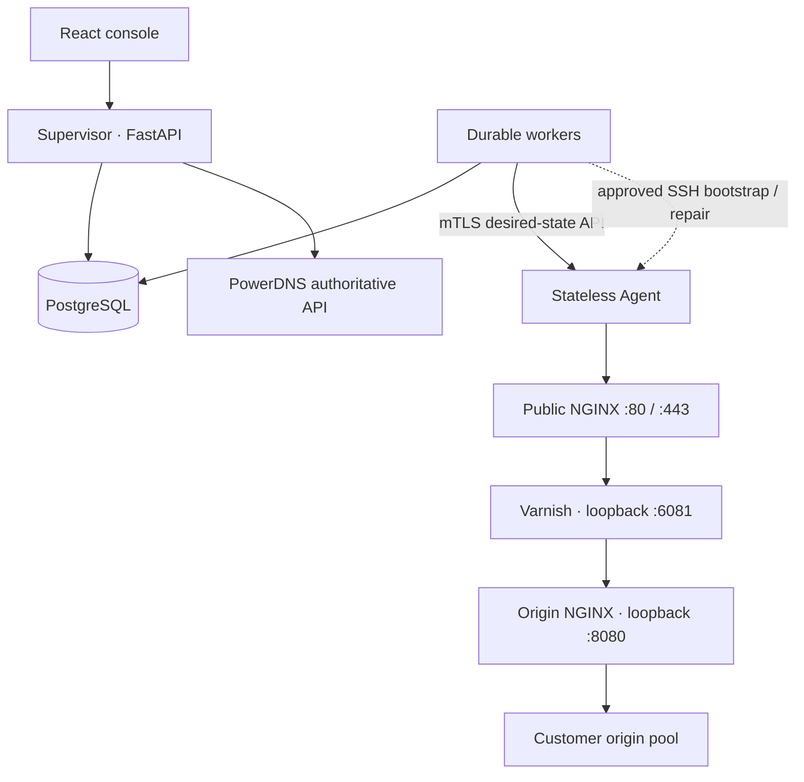

# Edgeplane CDN

A two-application DNS/unicast CDN control plane. **Supervisor** owns desired state
in PostgreSQL. The database-free **Agent** manages revisioned NGINX and Varnish
configuration on each edge. No BGP, Anycast, Redis, or arbitrary shell API.

This is an implemented and tested initial version, **not yet a production acceptance
sign-off**. See [acceptance evidence and remaining gaps](docs/acceptance.md) before
using it on a customer-serving node.



## Start the development console

```bash
python3 tools/dev_env.py     # once; refuses to overwrite existing .env
cd supervisor
docker compose up --build -d
```

Open **http://localhost:8000**. Username is `admin`; retrieve `ADMIN_PASSWORD`
from your local `supervisor/.env`. No shared default password exists. The first
login requires replacing the bootstrap password. Generated secrets are ignored
by Git and Docker build contexts.

The default Agent is an explicit simulation and performs no host service changes.
For a real NGINX/Varnish data plane inside an isolated lab container:

```bash
cd supervisor
docker compose -f docker-compose.yml -f docker-compose.lab.yml up --build -d
docker compose exec supervisor python -m app.seed_demo
curl -i -H 'Host: demo.example.com' http://localhost:8080/
```

The seed command is development-only. Five simulated city nodes are marked DEMO
and excluded from management jobs and DNS. One connected sandbox edge receives
the complete demo vhost through the normal worker/API path. See [E2E](docs/e2e.md).

## Projects

- [`supervisor/`](supervisor/README.md): async FastAPI, normalized SQLAlchemy models,
  Alembic, PostgreSQL workers, SSH provisioning, mTLS PKI, PowerDNS, React console.
- [`agent/`](agent/README.md): FastAPI, versioned wire contract, deterministic Jinja
  templates, host/sandbox adapters, atomic activation, purge, status and bounded logs.
- [`docs/`](docs/architecture.md): architecture, security, operations and test evidence.
- [`tools/`](tools/dev_env.py): development utilities, not a third application.

## Configuration lifecycle

Every vhost/policy mutation acquires a PostgreSQL transaction advisory lock and
creates a monotonically numbered immutable snapshot. Configuration and TLS key
material in snapshots are encrypted. Workers claim durable targets using
`FOR UPDATE SKIP LOCKED` and hold a per-node PostgreSQL session advisory lock
through the operation. A disconnected worker releases its lock, making unfinished
work reclaimable. The Agent adds an inter-process file lock and rejects stale
revisions. Equal content hashes are NOOPs without a reload.

Candidates are rendered into fresh release directories. Varnish compilation and
NGINX candidate validation precede activation. Every NGINX reload has its own
immediately preceding successful `nginx -t`. Validation failure restores the old
pointer and returns failure without reload. Historical rollback creates a new
revision and restores normalized desired vhost data, rather than editing history.

## Operations and deployment

See [Supervisor setup](supervisor/README.md), [Agent setup](agent/README.md),
[real Ubuntu provisioning](docs/agent-provisioning.md),
[security](docs/security.md), [configuration lifecycle](docs/config-lifecycle.md),
[caching](docs/caching.md), [DNS](docs/dns.md), and
[troubleshooting](docs/troubleshooting.md).

Production requires external PostgreSQL, HTTPS for the console, unique environment
secrets, an approved SSH host identity, and Agent mTLS. Kubernetes examples show
2 Supervisor and 2 worker replicas. Run the migration Job before rolling out pods.
The primary edge deployment is systemd; the Kubernetes Agent manifest is lab-only.

## Tests

```bash
python3 -m venv .venv
.venv/bin/pip install -e './supervisor[dev]'
(cd agent && ../.venv/bin/python -m pytest -q)
(cd supervisor && ../.venv/bin/python -m pytest -q)
.venv/bin/ruff check agent supervisor tools
npm --prefix supervisor/frontend ci
npm --prefix supervisor/frontend run build
```

PostgreSQL integration and real data-plane tests are explicitly opt-in, documented
in [test evidence](docs/acceptance.md). A skipped integration test is not evidence
of a working external system.
